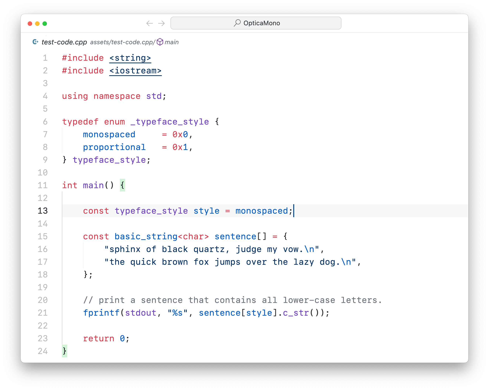

# The Optica Mono font family

Optica is a mono-spaced font family inspired by [Inter](https://rsms.me/inter/), [SF Mono](https://developer.apple.com/fonts/) and [JetBrains Mono](https://www.jetbrains.com/lp/mono/). This font family is still under development.

## Example

<!--  -->

<!-- 

 -->

